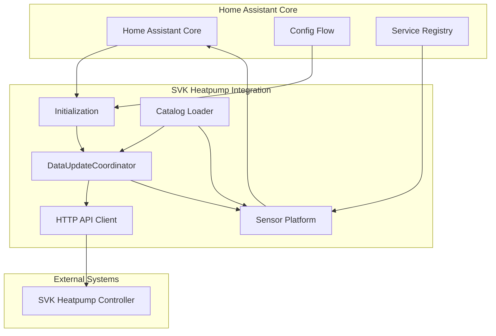
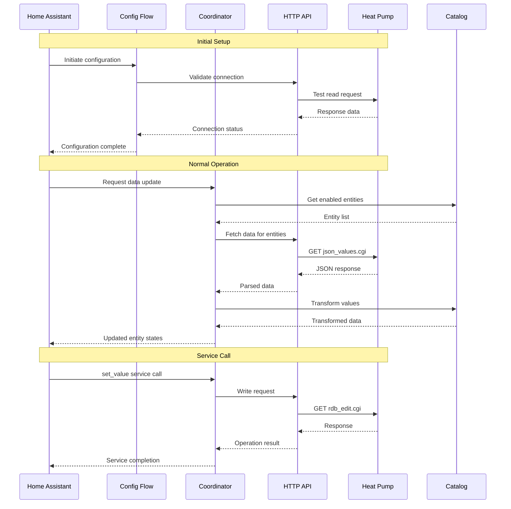

# SVK Heatpump Home Assistant Integration - Technical Specification

## 1. Overview

This document provides a comprehensive technical specification for the SVK Heatpump Home Assistant custom component (HACS integration). The integration enables monitoring and control of SVK heat pumps through HTTP communication with Digest Authentication.

### 1.1 Key Characteristics
- **Domain**: `svk_heatpump`
- **Integration Type**: Local polling with hub architecture
- **Authentication**: HTTP Digest Authentication
- **Communication**: HTTP GET requests to specific endpoints
- **Entity Management**: Catalog-driven architecture with YAML configuration
- **Data Model**: Sensor entities with value transformation capabilities

## 2. Complete File Structure

```
Repository Root/
├── README.md                    # Installation and setup documentation
├── info.md                      # HACS store description
├── logo.png                     # 128x128px integration logo
├── hacs.json                    # HACS metadata
└── custom_components/
    └── svk_heatpump/
        ├── __init__.py          # Integration initialization
        ├── manifest.json        # Integration metadata and dependencies
        ├── config_flow.py       # Configuration and options flow
        ├── const.py             # Constants and configuration schema
        ├── coordinator.py       # DataUpdateCoordinator implementation
        ├── api.py               # HTTP client and communication logic
        ├── sensor.py            # Sensor platform implementation
        ├── services.yaml        # Service definitions
        ├── catalog.yaml         # Entity definitions and properties
        └── translations/
            ├── en.json          # English translations
            └── da.json          # Danish translations
```

### 2.1 File Purpose Summary

| File | Purpose | Key Contents |
|------|---------|--------------|
| `__init__.py` | Integration entry point | Setup function, async_forward_entry_setups |
| `manifest.json` | Integration metadata | Domain, dependencies, requirements |
| `config_flow.py` | User configuration | Two-step config flow, validation, reauth |
| `const.py` | Constants and schemas | Configuration keys, domain constants |
| `coordinator.py` | Data management | Polling logic, error handling, data transformation |
| `api.py` | HTTP communication | Digest auth, request/response handling |
| `sensor.py` | Entity implementation | Sensor platform, CoordinatorEntity base |
| `services.yaml` | Service definitions | set_value service schema |
| `catalog.yaml` | Entity catalog | Entity definitions, properties, mappings |
| `translations/*.json` | Localization | UI strings, entity names, error messages |

## 3. Component Architecture Diagram



### 3.1 Architecture Components

1. **Initialization Layer** (`__init__.py`)
   - Entry point for Home Assistant
   - Sets up platforms based on catalog
   - Manages config entry lifecycle

2. **Configuration Layer** (`config_flow.py`)
   - Two-step configuration process
   - Connection validation
   - Reauthentication flow

3. **Data Coordination Layer** (`coordinator.py`)
   - Manages polling intervals
   - Handles error recovery
   - Transforms and caches data

4. **Communication Layer** (`api.py`)
   - HTTP client with Digest Authentication
   - Request/response handling
   - Connection management

5. **Entity Layer** (`sensor.py`)
   - Sensor platform implementation
   - Entity state management
   - Service integration

6. **Configuration Layer** (`catalog.yaml`)
   - Entity definitions
   - Property mappings
   - Value transformation rules

## 4. Data Flow Between Components



### 4.1 Data Flow Phases

1. **Configuration Phase**
   - User provides connection details
   - System validates connectivity
   - Configuration is stored

2. **Initialization Phase**
   - Catalog is loaded and parsed
   - Enabled entities are identified
   - Sensor entities are created

3. **Polling Phase**
   - Coordinator requests updates at intervals
   - API client fetches data from heat pump
   - Data is transformed according to catalog rules
   - Entity states are updated in Home Assistant

4. **Service Phase**
   - User calls set_value service
   - System resolves entity ID to heat pump ID
   - Write operation is performed
   - Result is logged and returned

## 5. Key Implementation Components

### 5.1 Catalog-Driven Architecture

The catalog system serves as the single source of truth for entity definitions:

```yaml
# catalog.yaml structure
sensors:
  - id: "297"                    # Heat pump internal ID
    key: heatpump_state          # Internal key and translation key
    enabled: true                # Whether to poll this entity
    platform: sensor             # Platform type
    device_class: ""             # Home Assistant device class
    unit_of_measurement: ""      # Measurement units
    state_class: ""              # State class for statistics
    icon: "mdi:heat-pump"        # Icon to display
    value_map:                   # Value transformation rules
      "0": "off"
      "1": "ready"
      "2": "startup"
      "5": "heating"
      "7": "defrost"
    precision: 0                  # Decimal precision for numbers
```

### 5.2 HTTP Communication Layer

The API client handles all communication with the heat pump:

**Read Operations:**
```
GET http://<IP>/cgi-bin/json_values.cgi?ids=<id1>;<id2>;...
Authorization: Digest <credentials>
```

**Write Operations:**
```
GET http://<IP>/cgi-bin/rdb_edit.cgi?itemval=<value>&itemno=<id>
Authorization: Digest <credentials>
```

**Key Implementation Details:**
- Uses `httpx.AsyncClient` with `httpx.DigestAuth`
- Implements connection timeouts (default 10 seconds)
- Handles authentication failures with reauth flow
- Provides retry logic with exponential backoff

### 5.3 DataUpdateCoordinator Implementation

The coordinator manages data polling and state synchronization:

```python
class SVKDataUpdateCoordinator(DataUpdateCoordinator):
    def __init__(self, hass, config_entry, api_client, catalog):
        # Initialize with configurable polling interval
        # Set up error handling and retry logic
        
    async def _async_update_data(self):
        # Fetch enabled entities from catalog
        # Build request URL with entity IDs
        # Execute HTTP request with error handling
        # Transform response data using catalog rules
        # Return transformed data for entity updates
```

### 5.4 Sensor Platform Implementation

Sensors are implemented as CoordinatorEntity instances:

```python
class SVKSensor(CoordinatorEntity, SensorEntity):
    def __init__(self, coordinator, entity_config, unique_id):
        # Initialize with catalog configuration
        # Set up entity attributes and properties
        
    @property
    def native_value(self):
        # Get raw value from coordinator data
        # Apply value transformation rules
        # Return transformed value
        
    @property
    def unique_id(self):
        # Return svk_heatpump-<host>-<id>
```

### 5.5 Service Implementation

The set_value service allows writing values to the heat pump:

```yaml
# services.yaml
set_value:
  name: Set value
  description: Set a value on the heat pump
  fields:
    entity_id:
      name: Entity ID
      description: Entity ID to set value for
      required: true
      selector:
        entity:
          domain: svk_heatpump
    value:
      name: Value
      description: Value to set
      required: true
```

Service handler implementation:
- Validates write access setting
- Resolves entity ID to heat pump ID
- Executes write operation
- Handles errors appropriately

## 6. Integration Patterns and Best Practices

### 6.1 Home Assistant Integration Patterns

1. **Domain Consistency**
   - All entities use `svk_heatpump` domain
   - Service names follow `svk_heatpump.action` pattern
   - Configuration keys use consistent prefixes

2. **Entity Management**
   - Unique IDs follow pattern: `svk_heatpump-<host>-<id>`
   - All entities extend CoordinatorEntity
   - Entity categories are properly configured

3. **Configuration Flow**
   - Two-step configuration process
   - Proper validation and error handling
   - Reauthentication flow for credential changes

### 6.2 Code Quality Standards

1. **Type Hints**
   - All functions and methods include type hints
   - Use of dataclasses or TypedDicts for structured data
   - Proper typing of async functions

2. **Documentation**
   - All functions include docstrings
   - Complex logic is commented appropriately
   - API documentation is included

3. **Error Handling**
   - Comprehensive error handling for all operations
   - User-friendly error messages
   - Proper logging without exposing credentials

### 6.3 Performance Considerations

1. **Async Operations**
   - All I/O operations are non-blocking
   - Proper use of asyncio patterns
   - Connection pooling and reuse

2. **Polling Optimization**
   - Configurable polling intervals
   - Efficient batch requests
   - Minimal data transfer

3. **Memory Management**
   - Efficient data structures
   - Proper cleanup on unload
   - Limited data caching

## 7. Error Handling Strategy

### 7.1 Connection Errors

| Error Type | Detection | Handling | User Experience |
|------------|-----------|----------|-----------------|
| Connection Timeout | httpx.TimeoutException | Log warning, return empty data | Entity becomes unavailable, coordinator retries |
| Authentication Failure | HTTP 401 | Trigger reauth flow | Configuration notification appears |
| Forbidden | HTTP 403 | Log error, treat as auth failure | Reauth flow initiated |
| Not Found | HTTP 404 | Log warning, return empty data | Entity becomes unavailable |
| Server Error | HTTP 5xx | Log error, return empty data | Entity becomes unavailable, coordinator retries |

### 7.2 Data Processing Errors

| Error Type | Detection | Handling | User Experience |
|------------|-----------|----------|-----------------|
| Invalid JSON | JSON parsing error | Log error, return empty data | Entity becomes unavailable |
| Missing Data | Expected key not found | Log warning, use default value | Entity shows default/unknown state |
| Type Mismatch | Unexpected data type | Log warning, skip entity | Entity becomes unavailable |
| Transformation Error | Value mapping fails | Log warning, use raw value | Entity shows raw value |

### 7.3 Service Errors

| Error Type | Detection | Handling | User Experience |
|------------|-----------|----------|-----------------|
| Write Access Disabled | Configuration setting | Raise HomeAssistantError | Service call fails with clear message |
| Invalid Entity ID | Entity not found | Raise HomeAssistantError | Service call fails with clear message |
| Network Timeout | Request timeout | Raise HomeAssistantError | Service call fails with clear message |
| Authentication Failure | HTTP 401 | Raise HomeAssistantError | Service call fails with clear message |
| Server Rejection | HTTP 4xx/5xx | Raise HomeAssistantError | Service call fails with clear message |

### 7.4 Error Recovery Mechanisms

1. **Automatic Retry**
   - Exponential backoff for transient failures
   - Maximum retry limits
   - Success recovery notifications

2. **Reauthentication Flow**
   - Automatic detection of auth failures
   - User notification for credential update
   - Seamless reconnection after update

3. **Graceful Degradation**
   - Partial data handling
   - Last known state preservation
   - Clear unavailable indicators

## 8. Security Considerations

### 8.1 Credential Management
- Passwords stored as secrets in Home Assistant
- No logging of credentials
- Secure transmission with Digest Authentication

### 8.2 Network Security
- HTTPS support where available
- Certificate validation
- Secure default configurations

### 8.3 Data Privacy
- Minimal data logging
- No sensitive data in logs
- Local processing only

## 9. Internationalization Strategy

### 9.1 Translation Structure
```json
{
  "config": {
    "step": {
      "user": {
        "title": "SVK Heatpump",
        "description": "Configure your SVK heat pump connection",
        "data": {
          "host": "Host/IP",
          "username": "Username",
          "password": "Password"
        }
      }
    }
  },
  "entity": {
    "sensor": {
      "heatpump_state": {
        "name": "Heat Pump State"
      },
      "heatpump_runtime": {
        "name": "Heat Pump Runtime"
      }
    }
  },
  "options": {
    "step": {
      "init": {
        "title": "SVK Heatpump Options",
        "data": {
          "write_access": "Enable Write Access",
          "fetch_interval": "Fetch Interval (seconds)"
        }
      }
    }
  }
}
```

### 9.2 Translation Requirements
- All entity names must use translation keys
- Configuration flow must be fully translated
- Error messages must be localized
- Danish translations must follow Home Assistant conventions

## 10. Testing Strategy

### 10.1 Manual Testing
- Test against real device at 192.168.50.9
- Verify authentication flow
- Test read and write operations
- Validate error handling

### 10.2 Integration Testing
- Configuration flow validation
- Entity creation and updates
- Service execution
- Error scenario handling

### 10.3 Performance Testing
- Polling efficiency
- Memory usage
- Response times
- Concurrent operations

## 11. Deployment Considerations

### 11.1 HACS Requirements
- Proper manifest.json configuration
- Repository structure compliance
- Documentation requirements
- Version management

### 11.2 Home Assistant Compatibility
- Minimum Home Assistant version requirements
- Dependency management
- Configuration migration
- Backward compatibility

### 11.3 User Experience
- Clear installation instructions
- Troubleshooting guidance
- Configuration examples
- Support channels

## 12. Future Extensibility

### 12.1 Platform Expansion
The architecture supports easy addition of new platforms:
- Binary sensors
- Number entities
- Switch entities
- Climate entities

### 12.2 Feature Expansion
Potential future enhancements:
- Advanced scheduling
- Energy monitoring
- Performance analytics
- Remote access support

### 12.3 Integration Expansion
Potential third-party integrations:
- Energy management systems
- Smart home platforms
- Mobile applications
- Cloud services

This technical specification provides a comprehensive foundation for implementing the SVK Heatpump Home Assistant integration with a focus on reliability, maintainability, and extensibility.